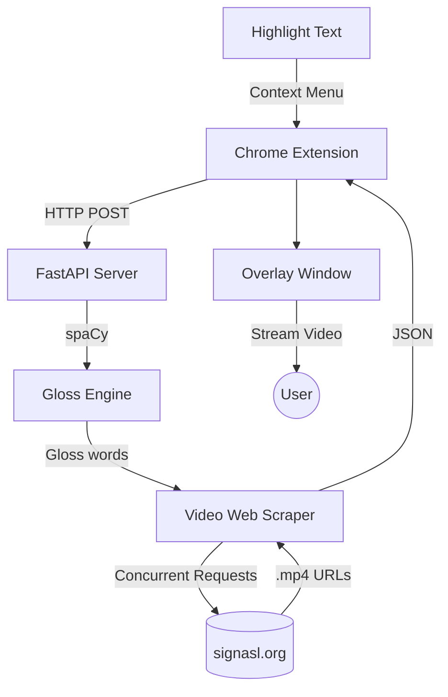

# Architecture Overview

SignBridge fundamentally separates its logic into a frontend Web Extension and an independent Backend API.

## 1. Browser Extension (Frontend)
The Google Chrome extension is responsible for extracting the text and rendering the remote ASL videos.
- **`manifest.json` & `background.js`**: Grants permissions across `<all_urls>` and hooks into Chrome's context menu. When a user highlights text, the background script alerts the content script.
- **`content.js`**: Listens for the translation command and injects an isolated HTML `iframe` into the host webpage to prevent any CSS/JS conflicts.
- **Overlay UI (`overlay.html`, `overlay.css`, `overlay.js`)**: 
  - Submits the highlighted text via HTTP POST to the backend.
  - Receives an ordered array of `.mp4` URLs.
  - Automatically sequences and plays these video elements through an HTML5 `<video>` player.

## 2. Backend API (FastAPI)
The backend intercepts English sentences and outputs remote MP4 paths.
- **`app.main`**: The Uvicorn-hosted API gateway exposing `POST /translate`.
- **`app.nlp_engine`**: Uses **spaCy** tokenization and dependency parsing. It filters out English stop words (is, am, are) and applies basic ASL structure modifications. Extracts root word lemmas.
- **`app.mapper`**: Employs **BeautifulSoup** and `requests` running concurrently inside a `ThreadPoolExecutor`. It queries an online sign dictionary (`signasl.org`) for each word outputted by the NLP engine, parses the DOM, and returns the direct `.mp4` video sources.

## Flow Diagram

